# Usefull Websites for Web Development  

### Software/Tools used

> 1. OS: Windows 10/11 x64
> 2. Visual Studio Code
> 3. GitHub Desktop

# Lets Get Started

## 1. W3Schools  

- W3Schools is a popular online platform that provides web development tutorials and references for various web technologies. It serves as a comprehensive resource for individuals who are learning or looking to enhance their skills in HTML, CSS, JavaScript.
- In addition to tutorials, W3Schools also provides comprehensive references for various web technologies, which serve as handy guides for developers when they need quick information or syntax references.The links are provided below :

> 1. Learn HTML :
<https://www.w3schools.com/html/default.asp>

> 2. Learn CSS :
<https://www.w3schools.com/css/default.asp>

> 3. Learn JS :
<https://www.w3schools.com/js/default.asp>

## 2. cdnjs

- cdnjs is a free and open-source software (FOSS) content delivery network (CDN) hosted by Cloudflare.It provides a large collection of popular  JavaScript and CSS libraries.

> ### font-awesome Library :

<https://cdnjs.com/libraries/font-awesome>  

---

### Copy the link tag highlighted in the image below

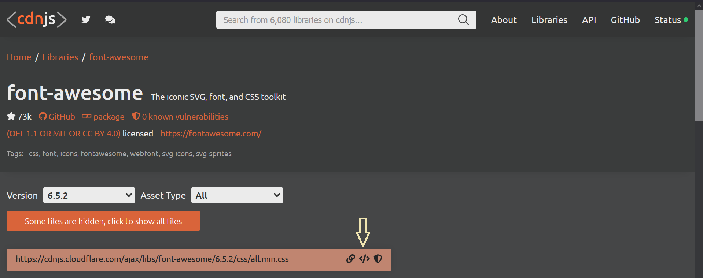

### Paste it in the HEAD section  

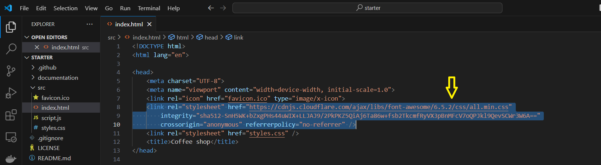

## 3. fontawesome

> Website link : <https://fontawesome.com/>

### Select an icon and customize it if you want  

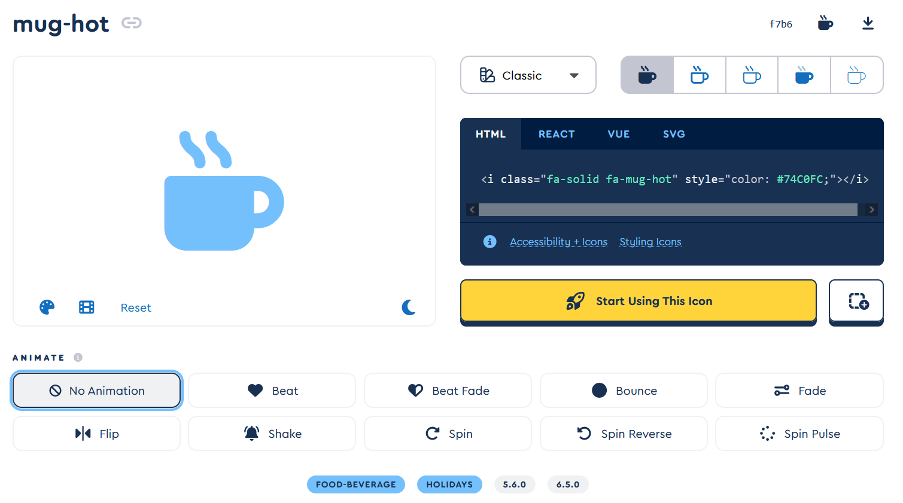  

### Copy its HTML code and paste it in the BODY section  

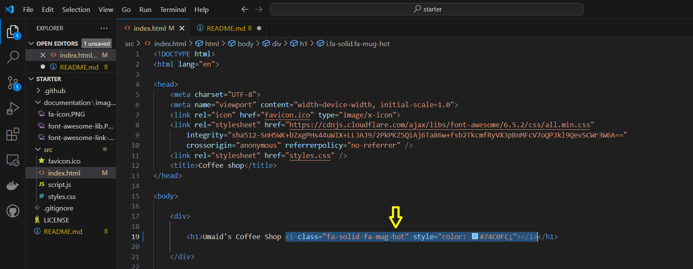  

### It is now displayed in your webpage  

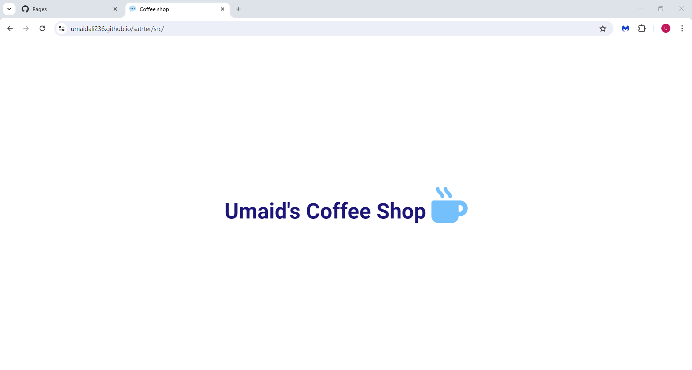  

## 4. Favicon

> Website Link : <https://favicon.io/>  

### Click on the emoji section

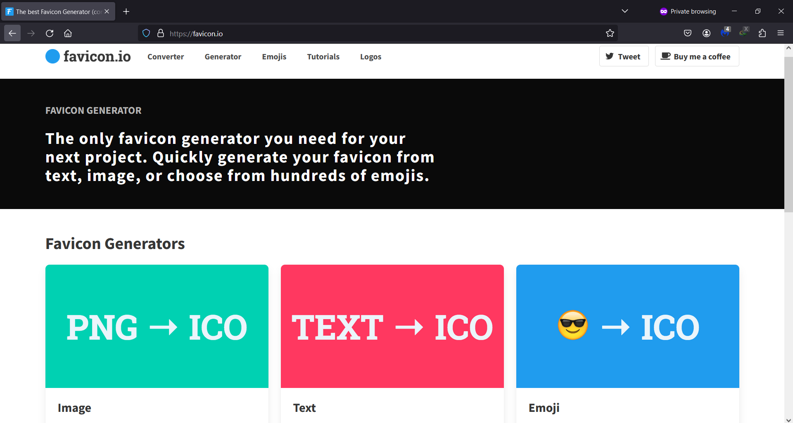  

---

### Select an emoji

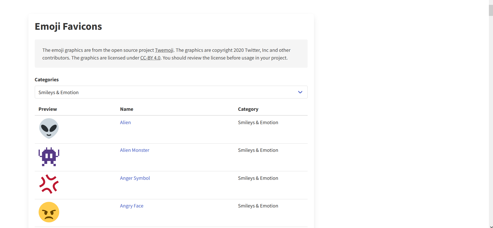  

---

### Download the emoji

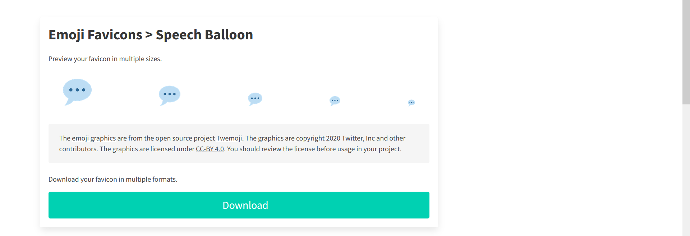  

---

### Paste it in the HEAD section

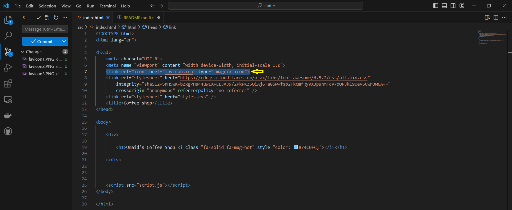  

---

### The emoji is now displayed in the browser tab  

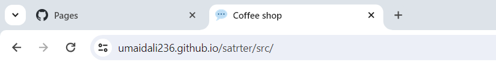

## 4. Color Hunt  

- Color Hunt is an open collection of color palettes. This tool serves thousands of color schemes for many different design and art purposes.

> Website Link : <https://colorhunt.co/>

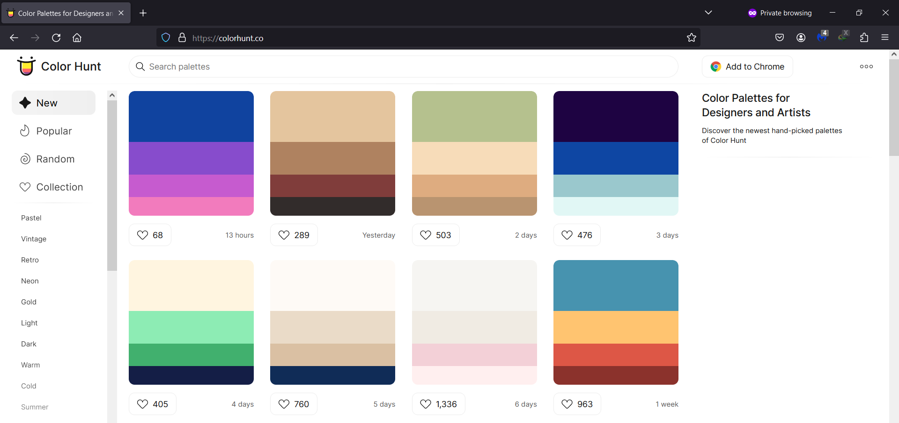

## 5. Font.Google  

- Google Fonts makes it easy to bring personality and performance to your websites and products.Their catalog of open-source fonts and icons, makes it easy to integrate expressive type and icons seamlessly.

> Website Link :  <https://fonts.google.com/>

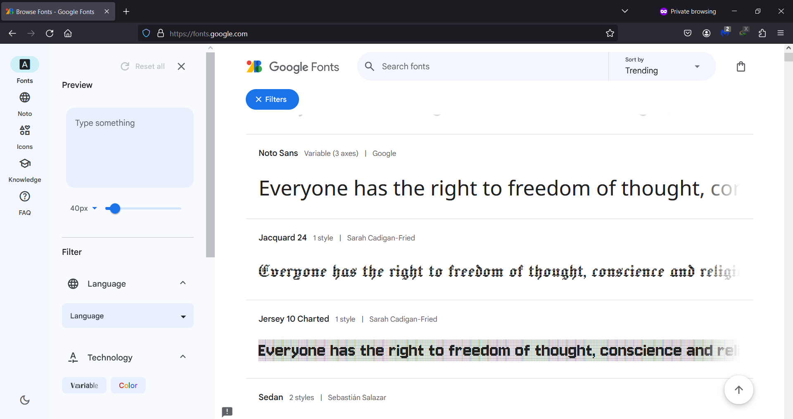
